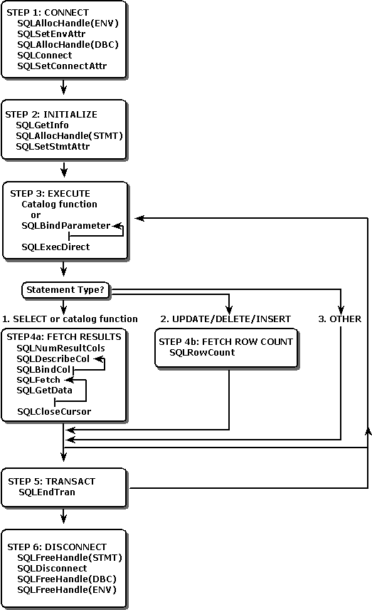

# ODBC Explained With Python
This repo show a working partial ODBC and PEP 249 implementation with pure Python - no C required!   

Using the Postgres fronend/backend TCP protocol we'll send and recieve bytes from Posgres and create some basic ODBC functions to handle the messages.  

We'll also look at how we can do the same using the Python PEP 249 standard to create a basic python Postgres driver, all just with the python standard library. 

This repo has a accompanying blog post here: <TBD>

<br/>

> *Note: Obviously a native python implementation will be slower than C libraries that already exist. This code is to help Python programers (myself included) get a better understanding of what is going on under the hood of ODBC drivers and databases.*

<br/>

# Overview

## PostgreSQL TCP Protocol
Before we start building our own Python native ODBC driver for Postgres, we need to get familiar with the Postgres Protocol.  
In the `simple_pg_protocol.py` file, there is code to send and receive messages to our Postgres database.  

Good resources to learn more about the protocol:
- [Postgres For The Wire](https://beta.pgcon.org/2014/schedule/attachments/330_postgres-for-the-wire.pdf)
- [YouTube: The PostgreSQL Protocol](https://www.youtube.com/watch?v=nh62VgNj6hY)
- [Postgres Docs](https://www.postgresql.org/docs/current/protocol-message-formats.html)

<br/>

## ODBC Basics

ODBC defines a set of standard interfaces and methods that must be implemented. An ODBC driver provides the interfaces and methods while a ODBC manager uses the interfaces provided by the driver.   
In this repo our ODBC driver will only implement minimal key functions to allow us to query Postgres.   

<br/>

A example typical ODBC applicaiton flow is shown below. This gives us an idea of which functions we'll need to implement in our python code.   
[Source](https://learn.microsoft.com/en-us/sql/odbc/reference/develop-app/basic-odbc-application-steps?view=sql-server-ver16)  


<br/>

## Python Native PEP 249 Implementation

In Python PEPs (Python Enhancement Proposals) are design documents for the python community. PEPs can contain information about various standards, and we will specificlaly be referencing **PEP 249 - Python Database API Specification v2.0**. This PEP outlines a standard set of interfaces for interacting with databases. If you have interacted with a database using python, the interfaces provided should look familiar:
*minimal example*
```python
conn = odbc_driver.connect(params)
cursor = conn.cursor()
cursor.execute(SQL_QUERY)
rows = cursor.fetchall()
```


An ODBC driver is not required for PEP 249. With our existing code we can implment PEP 249 in two ways:
1. Directly with our postgres protocol interface
2. On top of our existing ODBC driver code

<br/>

## Python Native ODBC Implementation

Once we have our implementation of the postgres protocol, we need to map our implmenetation to the standard ODBC functions. We'll implement the following key odbc functions below:
```python
SQLConnect, 
SQLExecDirect, 
SQLFetch, 
SQLGetData, 
SQLDisconnect
```


